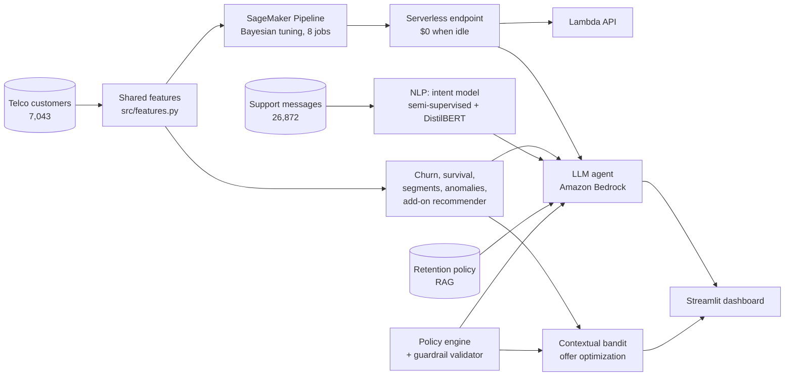

# RetainAI
# 🛡️ RetainAI — Autonomous Customer Retention Platform on AWS


An end-to-end AI system that predicts which telecom customers are about to leave, explains why, estimates the revenue at stake, reads what customers are saying, decides which retention offer is allowed and which works best, and uses an LLM agent to write the message — with guardrails enforced in code and every component evaluated.

**Headline:** about **$835K of 12-month revenue at risk** identified across 5,174 active customers. In simulation, a learned offer policy recovers **~$23K/year more than doing nothing** and **~$7K/year more than a hand-written business rule** for 1,303 at-risk customers, while blanket discounts *lose* about $21 per customer.

---

## Architecture



| Job requirement | Where it's demonstrated |
|---|---|
| Classification, regression, clustering, anomaly detection, recommendation | Churn classifier, Cox survival regression, K-means segments, Isolation Forest, add-on recommender (Block 1) |
| NLP, LLMs | Intent classification, fine-tuned DistilBERT, tool-using Bedrock agent with RAG (Blocks 3–4) |
| Curating datasets for generative models | Deduplicated, filtered, balanced chat-format fine-tuning set with a data card (Block 3) |
| Supervised, unsupervised, semi-supervised, RL, deep learning | All five: XGBoost, K-means, class-balanced self-training, contextual bandits, transformers |
| Pipelines, feature engineering, model selection, tuning | Shared feature module, model comparison, SageMaker Bayesian tuning (Blocks 1–2) |
| Production ML infrastructure | Serverless endpoint, Lambda API, training/serving parity tests, CI on every push (Blocks 2, 6) |

---

## Results

### Block 1 — ML core ([`01_ml_core.ipynb`](01_ml_core.ipynb))

| Model | Result |
|---|---|
| Logistic regression (baseline) | Test AUC **0.842** |
| Tuned XGBoost | Test AUC **0.845** |
| Cox survival model (handles censored tenure) | Concordance **0.862** |
| K-means segmentation | 6 segments; churn ranges from ~3% to ~57% |
| 12-month revenue at risk (active customers) | **$834,594** |

Finding: a well-regularized linear model nearly matches boosting on this tabular data. Survival analysis is used instead of plain regression because active customers haven't churned *yet*, so their tenure is censored.


### Block 2 — Production on SageMaker ([`02_production.ipynb`](02_production.ipynb))

- **Training/serving parity test:** the pure-Python encoder used in Lambda produces identical feature vectors to the pandas training pipeline (also enforced in CI).
- **Bayesian hyperparameter tuning:** 8 managed SageMaker training jobs.
- **Serverless inference:** billed per request, $0 when idle.
- **Lambda API:** a raw customer record in, a business answer out. Example: customer `5178-LMXOP` → 88.9% churn probability, **$1,014.71** revenue at risk. First call ~6 s (Lambda + serverless cold start).

### Block 3 — NLP, semi-supervised learning, deep learning ([`03_nlp.ipynb`](03_nlp.ipynb))

26,872 support messages, 27 intents, 8 flagged as churn signals.

| Labeled examples | Supervised | Naive self-training | **Class-balanced self-training** |
|---|---|---|---|
| 431 (2%) | 90.6% | 88.0% | **91.4%** (pseudo-labels 97.1% accurate) |
| 1,077 (5%) | 96.8% | 96.2% | **97.1%** |
| All labels | 99.5% | | |

Finding: scikit-learn's standard self-training can *hurt* with many classes and few labels, because confident pseudo-labels pile into a few classes. I implemented class-balanced self-training, which grows every class equally each round.

| Same 431 labels | Accuracy |
|---|---|
| TF-IDF + logistic regression | 90.6% |
| **DistilBERT fine-tuned (16 s)** | **94.7%** |

**LLM dataset curation:** 26,872 raw → 23,984 after near-duplicate removal (~2,900 duplicates, 11%) → 23,818 after length filters → 16,002 balanced → **15,201 train / 801 validation** in chat JSONL format. See the [data card](docs/llm_dataset_card.md), including its limitations (the source text appears template-generated).


### Block 4 — Tool-using LLM agent ([`04_agent.ipynb`](04_agent.ipynb), [`src/agent.py`](src/agent.py))

The agent calls five tools: customer profile, **live score from the production endpoint** with SHAP reasons, intent classifier, a **plan engine**, and **RAG** over the [retention policy and FAQ](docs/retention_policy.md).

**Design principle: code and learned models decide what to do; the LLM decides how to say it.**

**How it got there (iteration matters more than the first version):**

- **v1 let the LLM choose the offer.** It passed every guardrail, yet hands-on testing in the dashboard showed it was tone-deaf: a high-risk customer reporting a billing error got no help with the bill, just a pitch for a 12-month contract, with an invented "lock in your rate" perk. Guardrails guarantee *safety*, not *quality*.
- **Diagnosis:** (1) the policy only allowed a bill review when the anomaly detector fired, so the agent had no legitimate way to help; (2) the prompt never said "fix the problem first"; (3) the bandit's learned offer values never reached the agent; (4) a basic model has weak judgment about tone.
- **v2 moved decisions into a plan engine.** It combines the customer's risk, the message (intent model, trusted only above 50% confidence, plus keyword signals for billing problems, wanting to leave, and complaints), company policy, and the **Block 5 bandit's learned offer values** to decide: the resolution step, the offer, and whether to escalate. A customer who *says* they're leaving is treated as high risk even if the model disagrees. The LLM writes the reply in a fixed order: acknowledge, resolve, then optionally offer.
- **v2 replies were correct but generic.** The live judge score in the dashboard showed personalization at 2/5: the reply never used what we know about the customer or said why the offer suited them. The plan engine now passes **customer-safe facts** (tenure, plan, bill) and the offer's **benefit computed in code** ("saves $10.79 per month, about $130 over the year"), so the LLM personalizes without doing any math.
- **The validator grew from 7 to 11 checks**, adding: follows the plan, mentions the resolution, no invented perks, and **no invented dollar amounts** (every $ figure must come from the plan). It recomputes the plan from the real message, so the model can't sidestep it by paraphrasing.

v1 evaluation (LLM chooses offers):

| Model (10 scenarios) | Guardrail compliance | Judge score (1–5) | Latency | Tokens in / out | Tool calls |
|---|---|---|---|---|---|
| Amazon Nova 2 Lite | 90% | **3.63** | **1.9 s** | 4,344 / 223 | 3.8 |
| Amazon Nova Micro | 100% | 3.43 | 3.6 s | 5,124 / 682 | 4.4 |

Judge: Meta Llama 3.3 70B (a different model family, to avoid self-preference bias).

Finding: the model with the lower per-token price used ~3× the output tokens and nearly twice the latency, so it wasn't cheaper per task. Compare models on cost and quality *per completed task*, not price per token. The validator blocked 1 of 10 Nova 2 Lite responses from reaching a customer.

v2 evaluation (plan engine, 11 scenarios, Nova 2 Lite vs Nova Pro vs Nova Micro) is the next step; the notebook is ready to run.

### Block 5 — Reinforcement learning for offer optimization ([`05_bandit.ipynb`](05_bandit.ipynb), [`src/bandit.py`](src/bandit.py))

Contextual bandits (LinUCB and linear Thompson sampling, implemented from scratch) learn which offer maximizes 12-month net revenue per customer, constrained by the same policy engine as the agent. **Customer responses are simulated** from churn-model what-ifs plus explicit assumptions (acceptance rates, costs, 50% causal shrinkage); all assumptions are listed in [the results](docs/bandit_results.md).

| Policy (50,000 arrivals × 3 seeds) | Net revenue / customer | Lift vs no offer | Regret / customer (last 10K) |
|---|---|---|---|
| Always NO_OFFER | $473.44 | — | $20.52 |
| Always LOYALTY_DISCOUNT | $452.32 | **−$21.12** | $41.75 |
| Business rule | $485.39 | +$11.95 | $8.50 |
| **LinUCB** | $485.10 | +$11.66 | **$6.87** |
| Thompson sampling | $477.18 | +$3.74 | $12.71 |
| Oracle (knows true effects) | $493.78 | +$20.34 | $0 |

Findings:
- **Blanket discounts destroy value**: paying people who would have stayed anyway.
- **A good business rule is a strong baseline.** LinUCB starts behind and overtakes it after ~12K customers; the learned policy agrees with the oracle less often than the rule but makes its mistakes on low-stakes customers.
- **Low-spend customers are hardest to learn**, because small dollar differences are buried in stay/leave noise.
- **A unit test caught a real bug**: with all-positive rewards and a zero prior, bandits could lock in early, which likely explains Thompson sampling's plateau. Fixed by centering rewards (see `LinUCB.update`). The table above was produced before the fix; re-running with it is pending.


### Block 6 — Dashboard, tests, CI

- **Streamlit dashboard** ([`app/streamlit_app.py`](app/streamlit_app.py)): enter a customer ID to see their history and metrics (tenure, lifetime revenue, current bill vs their average, churn probability vs their segment, savings under the recommended offer, SHAP risk drivers), paste their message to see what they want and the recommended plan, then have the agent write the reply, with guardrail results and a live quality score from the judge model.
- **35 automated tests** ([`tests/`](tests/)) run on every push via GitHub Actions: training/serving parity, every guardrail violation type, message understanding (billing problem, leaving, complaint, low-confidence intents), JSON parsing of different model output styles, bandit learning and eligibility, and the Lambda handler with a mocked endpoint. No AWS access needed.

---

## Repository structure

```
├── 01_ml_core.ipynb … 05_bandit.ipynb   # one notebook per block, run in order
├── src/
│   ├── features.py      # shared feature code (training + serving)
│   ├── agent.py         # tools, Bedrock agent loop, guardrails, LLM judge
│   └── bandit.py        # offer simulator, LinUCB, Thompson sampling
├── api/handler.py       # Lambda handler (assembled into lambda_function.py)
├── app/streamlit_app.py # dashboard
├── tests/               # pytest suite, runs in CI
├── docs/                # policy, data card, eval transcripts, bandit results, figures
└── .github/workflows/   # CI
```

## Running it

1. Open SageMaker Studio (JupyterLab), clone the repo, and run the notebooks in order. Notebook 01 downloads the public Telco dataset; notebook 03 downloads the Bitext dataset from Hugging Face.
2. Block 2 deploys a serverless endpoint; the Lambda function is created in the console (steps in the notebook).
3. Block 4
