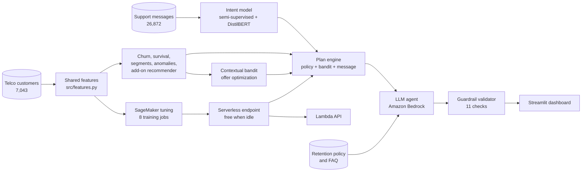
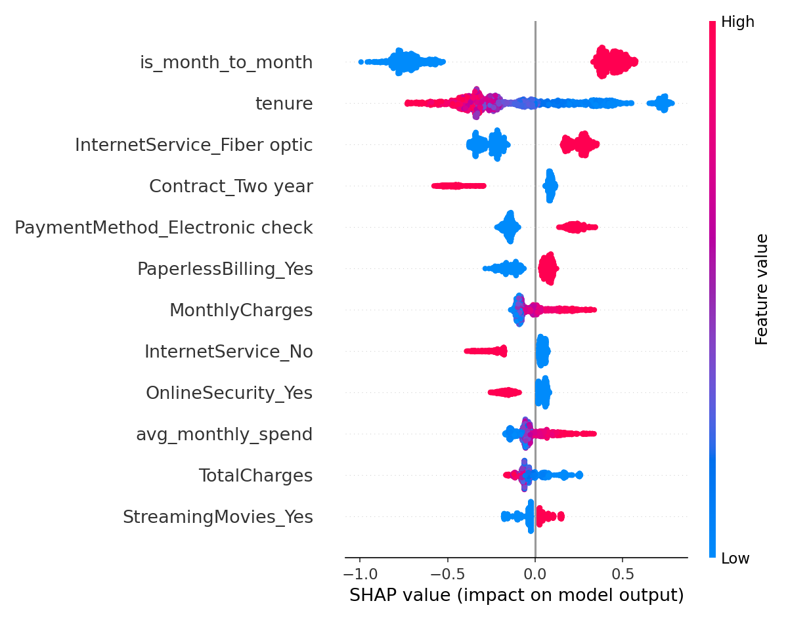
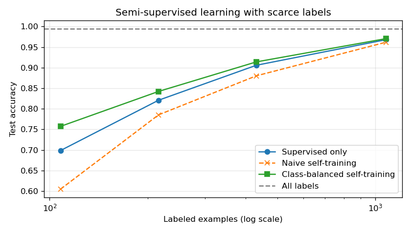
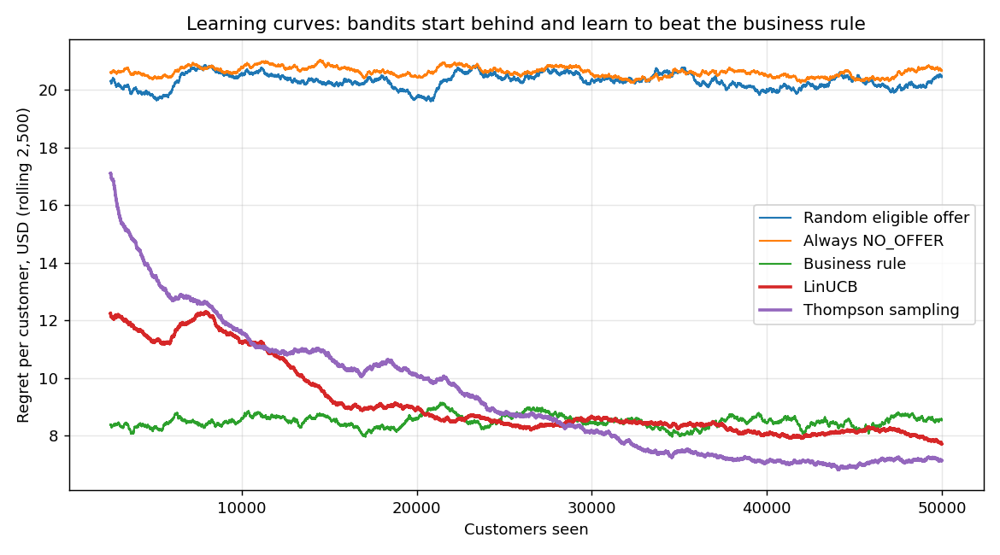

# 🛡️ RetainAI — Autonomous Customer Retention Platform on AWS


An end-to-end AI system that predicts which telecom customers are about to leave, explains why, estimates the revenue at stake, understands what customers are saying, decides the right action and offer, and uses an LLM agent to write the reply — with business rules enforced in code, guardrails on every response, and every component evaluated.

> **Headline:** about **$835K of 12-month revenue at risk** identified across 5,174 active customers. In simulation, a learned offer policy earns **~$23K/year more than doing nothing** and **~$7K/year more than a hand-written business rule** across 1,303 at-risk customers, while blanket discounts *lose* about $21 per customer.

**Contents:** [Architecture](#architecture) · [Results](#results) · [Engineering lessons](#engineering-lessons) · [Repository](#repository-structure) · [Running it](#running-it) · [Limitations](#limitations-and-next-steps)

---

## Architecture



**Design principle:** code and learned models decide *what to do*; the LLM decides *how to say it*; a validator checks every reply before it can reach a customer.

| Job requirement | Where it's demonstrated |
|---|---|
| Classification, regression, clustering, anomaly detection, recommendation | Churn classifier, Cox survival regression, K-means segments, Isolation Forest, add-on recommender ([Block 1](#block-1--ml-core)) |
| NLP, LLMs | Intent classification, fine-tuned DistilBERT, tool-using Bedrock agent with retrieval ([Blocks 3](#block-3--nlp-semi-supervised-learning-deep-learning)–[4](#block-4--tool-using-llm-agent)) |
| Curating datasets for generative models | Deduplicated, filtered, balanced chat-format fine-tuning set with a [data card](docs/llm_dataset_card.md) ([Block 3](#block-3--nlp-semi-supervised-learning-deep-learning)) |
| Supervised, unsupervised, semi-supervised, RL, deep learning | All five: XGBoost, K-means, class-balanced self-training, contextual bandits, transformers |
| Pipelines, feature engineering, model selection, tuning | Shared feature module, model comparison, SageMaker Bayesian tuning ([Blocks 1](#block-1--ml-core)–[2](#block-2--production-on-sagemaker)) |
| Production ML infrastructure | Serverless endpoint, Lambda API, training/serving parity tests, CI on every push ([Blocks 2](#block-2--production-on-sagemaker), [6](#block-6--dashboard-tests-ci)) |

**Tech stack:** Python · pandas · scikit-learn · XGBoost · SHAP · lifelines · PyTorch · Hugging Face Transformers · Amazon SageMaker (training, tuning, serverless inference) · Amazon Bedrock · AWS Lambda · Amazon S3 · Streamlit · pytest · GitHub Actions

---

## Results

### Block 1 — ML core

Notebook: [`01_ml_core.ipynb`](01_ml_core.ipynb)

| Model | Result |
|---|---|
| Logistic regression (baseline) | Test AUC **0.842** |
| Tuned XGBoost | Test AUC **0.845** |
| Cox survival model (handles censored tenure) | Concordance **0.862** |
| K-means segmentation | 6 segments; churn ranges from ~3% to ~57% |
| 12-month revenue at risk (active customers) | **$834,594** |

- A well-regularized linear model nearly matches boosting on this tabular data.
- Survival analysis is used instead of plain regression because active customers haven't churned *yet*, so their tenure is censored.



### Block 2 — Production on SageMaker

Notebook: [`02_production.ipynb`](02_production.ipynb) · Lambda handler: [`api/handler.py`](api/handler.py)

- **Training/serving parity test:** the pure-Python encoder used in Lambda produces identical feature vectors to the pandas training pipeline (also enforced in CI).
- **Bayesian hyperparameter tuning:** 8 managed SageMaker training jobs with early stopping.
- **Serverless inference:** billed per request, free when idle.
- **Lambda API:** a raw customer record in, a business answer out. Example: customer `5178-LMXOP` → 88.9% churn probability, **$1,014.71** revenue at risk. First call ~6 s (Lambda plus serverless cold start).

### Block 3 — NLP, semi-supervised learning, deep learning

Notebook: [`03_nlp.ipynb`](03_nlp.ipynb) · Data card: [`docs/llm_dataset_card.md`](docs/llm_dataset_card.md)

26,872 support messages, 27 intents, 8 flagged as churn signals.

| Labeled examples | Supervised | Naive self-training | **Class-balanced self-training** |
|---|---|---|---|
| 431 (2%) | 90.6% | 88.0% | **91.4%** (pseudo-labels 97.1% accurate) |
| 1,077 (5%) | 96.8% | 96.2% | **97.1%** |
| All labels | 99.5% | | |

scikit-learn's standard self-training can *hurt* with many classes and few labels, because confident pseudo-labels pile into a few classes. I implemented class-balanced self-training, which grows every class equally each round.

| Same 431 labels | Accuracy |
|---|---|
| TF-IDF + logistic regression | 90.6% |
| **DistilBERT, fine-tuned (16 s on GPU)** | **94.7%** |

**LLM dataset curation:** 26,872 raw → 23,984 after near-duplicate removal (~2,900 duplicates, 11%) → 23,818 after length filters → 16,002 balanced → **15,201 train / 801 validation** in chat JSONL format. The [data card](docs/llm_dataset_card.md) documents each step and the dataset's limitations (the source text appears template-generated).



### Block 4 — Tool-using LLM agent

Notebook: [`04_agent.ipynb`](04_agent.ipynb) · Code: [`src/agent.py`](src/agent.py) · Policy and FAQ: [`docs/retention_policy.md`](docs/retention_policy.md) · Example transcripts: [`docs/agent_examples.md`](docs/agent_examples.md)

The agent calls five tools: customer profile, **live score from the production endpoint** with SHAP reasons, intent classifier, the **plan engine**, and retrieval over the retention policy and FAQ.

**How it got here — iteration mattered more than the first version:**

1. **v1 let the LLM choose the offer.** It passed every guardrail, yet hands-on testing in the dashboard showed it was tone-deaf: a high-risk customer reporting a billing error got no help with the bill, just a pitch for a 12-month contract with an invented "lock in your rate" perk. *Guardrails guarantee safety, not quality.*
2. **Diagnosis:** the policy only allowed a bill review when the anomaly detector fired, so the agent had no legitimate way to help; the prompt never said "fix the problem first"; the bandit's learned offer values never reached the agent; and a basic model has weak judgment about tone.
3. **v2 moved decisions into a plan engine.** It combines the customer's risk, their message (intent model, trusted only above 50% confidence, plus keyword signals for billing problems, wanting to leave, and complaints), company policy, and the **Block 5 bandit's learned offer values** to decide the resolution step, the offer, and whether to escalate. A customer who *says* they're leaving is treated as high risk even if the model disagrees. The LLM writes the reply in a fixed order: acknowledge, resolve, then optionally offer.
4. **v2 replies were correct but generic** (live judge score for personalization: 2/5). The plan engine now passes **customer-safe facts** (tenure, plan, bill) and the offer's **benefit computed in code** ("saves $10.79 per month, about $130 over the year"), so the LLM personalizes without doing any math.
5. **The validator grew from 7 to 11 checks:** valid output, required tools called, offer eligible, follows the plan, resolution mentioned, discount within policy, no invented dollar amounts, no internal terms, no invented perks, correct escalation, length. It recomputes the plan from the real message, so the model can't sidestep it by paraphrasing.

**v1 evaluation** (LLM chooses offers, 10 scenarios; judge: Meta Llama 3.3 70B, a different model family to avoid self-preference bias):

| Model | Guardrail compliance | Judge score (1–5) | Latency | Tokens in / out | Tool calls |
|---|---|---|---|---|---|
| Amazon Nova 2 Lite | 90% | **3.63** | **1.9 s** | 4,344 / 223 | 3.8 |
| Amazon Nova Micro | 100% | 3.43 | 3.6 s | 5,124 / 682 | 4.4 |

- The model with the lower per-token price used ~3× the output tokens and nearly twice the latency, so it wasn't cheaper per task. Compare models on cost and quality *per completed task*, not price per token.
- The validator blocked 1 of 10 Nova 2 Lite responses from reaching a customer.

**v2 evaluation** (plan engine, 11 scenarios, 11 guardrail checks; same judge):

| Model | Guardrail compliance | Judge score (1–5) | Latency | Tokens in / out | Tool calls |
|---|---|---|---|---|---|
| Amazon Nova 2 Lite | 82% | **4.14** | **2.0 s** | 4,643 / 277 | 3.5 |
| Amazon Nova Pro | **100%** | 3.96 | 3.7 s | 3,752 / 357 | 3.3 |
| Amazon Nova Micro | 91% | 3.96 | 2.7 s | 4,026 / 510 | 3.3 |

- **Reply quality rose for every model** (judge score +0.5 for both Nova 2 Lite and Nova Micro versus v1): replies now resolve the issue first, use the customer's real details, and quote savings computed in code.
- **Compliance is measured against a stricter bar** (11 checks vs 7). Both Nova 2 Lite failures came from the new no-invented-perks check, the exact problem v1 had; in v2 those replies were blocked before reaching a customer.
- **Nova Pro was the only model with zero guardrail failures.** A practical production setup: use Nova 2 Lite for its quality and speed, and retry once (or fall back to Nova Pro) when a reply fails a guardrail.
- Scenario sets differ between v1 and v2 (10 vs 11), so judge quality is the fairer comparison than compliance rate.

### Block 5 — Reinforcement learning for offer optimization

Notebook: [`05_bandit.ipynb`](05_bandit.ipynb) · Code: [`src/bandit.py`](src/bandit.py) · Full results and assumptions: [`docs/bandit_results.md`](docs/bandit_results.md)

Contextual bandits (LinUCB and linear Thompson sampling, implemented from scratch) learn which offer maximizes 12-month net revenue per customer, constrained by the same policy engine as the agent. **Customer responses are simulated** from churn-model what-ifs plus explicit assumptions (acceptance rates, costs, 50% causal shrinkage), all listed in the results file.

| Policy (50,000 arrivals × 3 seeds) | Net revenue / customer | Lift vs no offer | Regret / customer (last 10K) |
|---|---|---|---|
| Always NO_OFFER | $473.44 | — | $20.52 |
| Always LOYALTY_DISCOUNT | $452.32 | **−$21.12** | $41.75 |
| Business rule | $485.39 | +$11.95 | $8.50 |
| LinUCB | $484.94 | +$11.51 | $8.02 |
| **Thompson sampling** | $483.78 | +$10.34 | **$7.10** |
| Oracle (knows true effects) | $493.78 | +$20.34 | $0 |

Value of the final learned policies (noise-free):

| Policy | Value / customer | Agrees with oracle | Gap to oracle |
|---|---|---|---|
| Business rule | $484.26 | 80.4% | $8.45 |
| **LinUCB (learned)** | **$489.89** | 77.7% | **$2.81** |
| Thompson sampling (learned) | $489.61 | 78.4% | $3.10 |
| Oracle | $492.71 | 100% | $0 |

- **Blanket discounts destroy value:** they pay people who would have stayed anyway.
- **A good business rule is a strong baseline.** The bandits start behind it and pay an exploration cost, then overtake it (LinUCB after ~22K customers, Thompson sampling after ~27K). Once trained, they close about two-thirds of the rule's gap to the oracle.
- **The learned policies agree with the oracle *less* often than the rule, yet earn more**, because their mistakes fall on low-stakes customers.
- **A unit test caught a real bug** (see [Engineering lessons](#engineering-lessons)); fixing it cut Thompson sampling's late-stage regret by 44%.



### Block 6 — Dashboard, tests, CI

Dashboard: [`app/streamlit_app.py`](app/streamlit_app.py) · Tests: [`tests/`](tests/) · CI: [`.github/workflows/ci.yml`](.github/workflows/ci.yml)

- **Streamlit dashboard:** enter a customer ID to see their history and metrics (tenure, lifetime revenue, current bill vs their average, churn probability vs their segment, savings under the recommended offer, SHAP risk drivers); paste their message to see what they want and the recommended plan; then have the agent write the reply, with guardrail results and a live quality score from the judge model.
- **35 automated tests** run on every push via GitHub Actions, with no AWS access needed: training/serving parity, every guardrail violation type, message understanding (billing problem, leaving, complaint, low-confidence intents), JSON parsing of different model output styles, bandit learning and eligibility, and the Lambda handler with a mocked endpoint.

---

## Engineering lessons

These are the moments where testing changed the outcome:

| What happened | How it was caught | Fix | Effect |
|---|---|---|---|
| The agent's replies were policy-compliant but tone-deaf | Hands-on testing in the dashboard | Plan engine decides actions; LLM only writes | Billing problems now get resolved first, offers second |
| Replies were generic | Live judge score (personalization 2/5) | Customer facts and code-computed offer benefits | Personalized replies with verified numbers |
| Bandits could lock in early with all-positive rewards | Unit test on a toy problem | Reward centering in `LinUCB.update` | Thompson sampling regret −44% ($12.71 → $7.10) |
| Label encoding broke under pandas 3 (text stored as a new string type) | CI failed on GitHub with fresh installs while local tests passed on pandas 2 | Version-independent check in `build_frame` | Works on pandas 2 and 3 |
| Standard self-training hurt accuracy with scarce labels | Comparison against a supervised baseline | Class-balanced self-training | Beats both baselines at 2% labels |

---

## Repository structure

```
├── 01_ml_core.ipynb … 05_bandit.ipynb   # one notebook per block, run in order
├── src/
│   ├── features.py      # shared feature code (training + serving)
│   ├── agent.py         # tools, plan engine, Bedrock agent loop, guardrails, LLM judge
│   └── bandit.py        # offer simulator, LinUCB, Thompson sampling
├── api/handler.py       # Lambda handler (assembled into lambda_function.py)
├── app/streamlit_app.py # dashboard
├── tests/               # pytest suite, runs in CI
├── docs/                # policy and FAQ, data card, transcripts, bandit results, figures
└── .github/workflows/   # CI
```

## Running it

1. Open SageMaker Studio (JupyterLab), clone the repo, and install dependencies: `pip install -r requirements.txt`.
2. Run the notebooks in order. Notebook 01 downloads the public Telco dataset; notebook 03 downloads the Bitext dataset from Hugging Face.
3. Block 2 deploys a serverless endpoint; the Lambda function is created in the console (steps in the notebook).
4. Block 4 needs Amazon Bedrock access for the models listed at the top of [`src/agent.py`](src/agent.py). Any Bedrock model with tool use can be swapped in.
5. Dashboard: `streamlit run app/streamlit_app.py --server.port 8501`. In SageMaker Studio, open it at your JupyterLab URL with `/jupyterlab/default/proxy/8501/` in place of the path.
6. Tests: `pip install -r requirements-ci.txt && pytest -q`.

**Cost:** the serverless endpoint and Lambda are free when idle. Stop the Studio space when finished.

## Limitations and next steps

- Offer effects are **simulated**. In production, the simulator would be replaced by randomized A/B tests, and the bandit would learn from real outcomes.
- The support-message dataset is general e-commerce and largely template-generated; real telecom messages would be noisier.
- The survival model ranks customers well (concordance 0.86), but its absolute "months remaining" estimates are not calibrated, so the dashboard does not display them.
- The agent evaluation uses 10–11 scenarios; a production evaluation set would be larger and include adversarial inputs.
- **Next:** pluralize customer facts ("1 month", not "1 months"), validate the `resolution` field against the plan's code, retry-on-guardrail-failure with model fallback, dashboard screenshots, infrastructure as code (CDK), SageMaker Model Monitor for drift, and an authenticated API Gateway front end.
